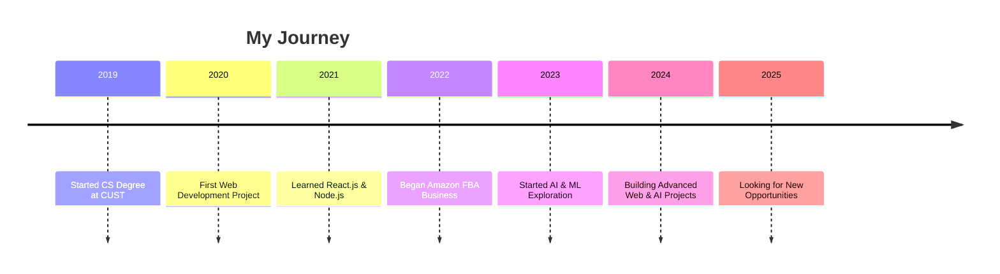

  
  
  # Saeed Ur Rehman

  
  
  
  
  
  
  
  

## 👨‍💻 About Me

> **"Building innovative solutions one line of code at a time."**

I'm a Computer Science student at **CUST, Islamabad** with a passion for creating impactful software solutions. I thrive at the intersection of web development and artificial intelligence, always pushing the boundaries of what's possible.

- 🚀 Currently building AI-powered web applications
- 🌱 Exploring advanced concepts in React.js, Python, and ML
- 💡 Turning complex problems into elegant solutions
- 🔍 Passionate about clean code and user-centric design
- 🌐 Constantly learning and adapting to new technologies

📌 Click for more about my journey

 

I began my programming journey with a simple HTML page and quickly found myself fascinated by the endless possibilities of web development. As I progressed, I discovered my passion for creating seamless user experiences and solving complex problems through code.

My interest in AI and machine learning emerged as I saw the transformative impact these technologies could have across industries. Now, I'm dedicated to building solutions that leverage both web technologies and AI to create truly innovative products.

At CUST, I've had the opportunity to deepen my theoretical understanding while applying practical skills through various projects. I believe in continuous learning and pushing beyond comfort zones to grow as a developer.

## 🛠️ Tech Stack

### Web Development

### AI & Machine Learning

### Database & Tools

### Business & Design

## 📊 GitHub Analytics

  
  

  

## 📈 Contribution Graph

  

## 🚀 Featured Projects

  
  

  
  

### Project Highlights

#### [Callovate](https://github.com/saeedmirza4/callovate)
A sophisticated calorie calculator with intuitive UI that helps users track nutritional intake. Features include:
- Real-time calorie tracking
- Personalized nutritional recommendations
- Clean, responsive interface
- Data visualization for progress tracking

**Tech Stack:** React.js, JavaScript, CSS, Chart.js

#### [Grammar Fixer](https://github.com/saeedmirza4/grammar-fixer)
A streamlined grammar correction tool inspired by Grammarly:
- Instant grammar and spelling correction
- Style suggestions for improved writing
- Browser extension integration
- API-powered language processing

**Tech Stack:** JavaScript, HTML, CSS, NLP API Integration

#### [JavaScript Utilities & Tools](https://github.com/saeedmirza4/js-utilities)
A comprehensive collection of JavaScript utilities solving common web development challenges:
- Data validation helpers
- DOM manipulation utilities
- Custom animation libraries
- Responsive design tools

**Tech Stack:** JavaScript, HTML, CSS, ES6+

## 💼 Work Experience & Education

## 🌟 What Sets Me Apart

- **Problem-Solving Mindset**: I approach challenges with creativity and persistence
- **Full-Stack Versatility**: Comfortable working across the entire development stack
- **AI & ML Knowledge**: Bringing cutting-edge tech to practical applications
- **Business Acumen**: Understanding of product development and market fit
- **Continuous Learner**: Always exploring new technologies and methodologies

## 📫 Let's Connect

  
  
  
  

  <h3>💬 I'm open to collaborate on innovative projects and exciting opportunities!</h3>

---

  
  
  © 2025 Saeed Ur Rehman. All rights reserved.

